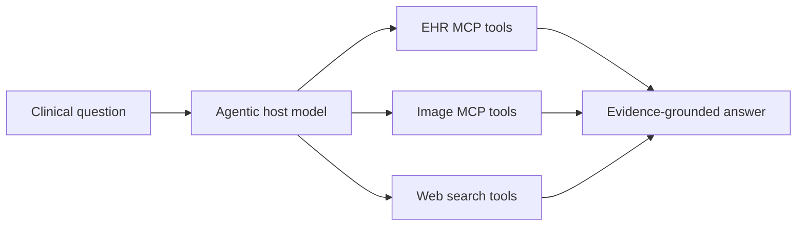

<div align="center">

# 🔎 ClinSeekAgent

**Automating multimodal evidence seeking for agentic clinical reasoning**

[](#install)
[](#repository-layout)
[](#data-artifacts)
[](LICENSE)

[Paper](#citation) • [Quick Start](#quick-start) • [Data](#data-artifacts) • [Training](#sft-training) • [Responsible Use](#responsible-use)

</div>

ClinSeekAgent is a multimodal evidence-seeking pipeline for agentic clinical reasoning. It gives a host model access to patient-level EHR tools, web search tools, and medical-image tools, then evaluates the model in an automated evidence-seeking setting instead of a curated-context setting.

This repository is prepared as the public code release for:

> **ClinSeek: Automating Multimodal Evidence Seeking for Agentic Clinical Reasoning**

> [!IMPORTANT]
> This public release intentionally does **not** include raw MIMIC data, generated patient databases, chest X-ray files, private trajectories, model weights, or experiment logs. Data and model artifacts should be released separately on Hugging Face after the relevant access and license checks.

<a id="why-clinseekagent"></a>
## ✨ Why ClinSeekAgent?

ClinSeekAgent turns clinical QA into an evidence-seeking workflow: the model must decide what to inspect, which tools to call, and how to assemble evidence across structured EHR tables, candidate sets, web search, and medical images.



<a id="repository-layout"></a>
## 🧩 Repository Layout

| Path | Purpose |
| --- | --- |
| `openresearcher_ehr/` | Agentic and one-shot drivers, LLM backends, tool pools, and scorers |
| `src/run_mcp_server.py` | EHR MCP server |
| `src/agentlite/mcp_tools/` | EHR table, SQL, candidate, and utility tools |
| `src/mcp_image/` | Medical-image MCP server and image tools |
| `verl/` | Vendored VERL training code and ClinSeek SFT recipes |
| `scripts/` | Public launchers for MCP servers, evaluation, vLLM, and SFT |
| `docs/` | Release, data, benchmark, and training documentation |
| `venvs/requirements/` | Split dependency files for agent, EHR MCP, and image MCP roles |
| `examples/` | Synthetic manifest examples only |

<a id="install"></a>
## ⚙️ Install

Use separate environments for the lightweight agent driver, the EHR MCP server, and the image MCP server when running the full multimodal pipeline.

```bash
python -m venv .venv
source .venv/bin/activate
pip install -r requirements.txt
cp .env.example .env
```

Role-specific dependencies are available in `venvs/requirements/`.

<a id="data-artifacts"></a>
## 📦 Data & Artifacts

Data is not stored in Git. Set `CLINSEEK_DATA_ROOT` to a prepared benchmark tree after obtaining the required credentialed datasets from their official sources.

```bash
export CLINSEEK_DATA_ROOT=/path/to/clinseek_bench
export CLINSEEK_MODEL_DIR=/path/to/model_or_served_model
```

Primary external artifacts:

- 🧪 Benchmark inputs and DBs: [`UCSC-VLAA/ClinSeek-Bench`](https://huggingface.co/datasets/UCSC-VLAA/ClinSeek-Bench)
- 📊 Evaluation results: [`UCSC-VLAA/ClinSeek-Evaluation-Results`](https://huggingface.co/datasets/UCSC-VLAA/ClinSeek-Evaluation-Results)

See [`RESOURCES.md`](RESOURCES.md), [`docs/data_access.md`](docs/data_access.md), and [`docs/data_release.md`](docs/data_release.md) for access notes and expected release structure.

<a id="quick-start"></a>
## 🚀 Quick Start

Start an EHR MCP server:

```bash
bash scripts/run_ehr_mcp.sh
```

Run a text-only evaluation file:

```bash
DATA_PATH=examples/synthetic_text_sample.jsonl \
OUTPUT_DIR=outputs/text_smoke \
bash scripts/run_text_eval.sh
```

For multimodal runs, start the image MCP server and provide a manifest whose image paths resolve under `BENCH_ROOT`:

```bash
bash scripts/run_image_mcp.sh

DATA_PATH=examples/synthetic_multimodal_sample.jsonl \
OUTPUT_DIR=outputs/mm_smoke \
bash scripts/run_mm_eval.sh
```

The example files are schema examples, not a replacement for the benchmark data.

<a id="supported-workflows"></a>
## 🧪 Supported Workflows

- ✨ **Agentic text-only evaluation** over patient-level EHR tables and candidate sets.
- 🩻 **Multimodal evaluation** that combines EHR evidence with linked chest X-ray inputs.
- 🧠 **One-shot baselines** for comparing curated-context reasoning against tool-mediated evidence seeking.
- 🛠️ **MCP tool serving** for EHR tables, SQL-style access, candidates, image inputs, and utility tools.
- 📚 **SFT data preparation and training recipes** using the vendored `verl/` training code.

<a id="sft-training"></a>
## 🏋️ SFT Training

Prepare trajectory parquet files:

```bash
python prepare_clinseek_data.py \
  --repo_id <hf-org-or-user>/<trajectory-dataset> \
  --filename clinseek_trajectories.jsonl \
  --model_name Qwen/Qwen3.5-35B-A3B \
  --max_token_length 52000 \
  --output_dir data/clinseek_trajectory_qwen35_52k
```

Run SFT with the vendored VERL training code:

```bash
TRAIN_FILES=data/clinseek_trajectory_qwen35_52k/train.parquet \
VAL_FILES=data/clinseek_trajectory_qwen35_52k/val.parquet \
MODEL_PATH=/path/to/Qwen3.5-35B-A3B \
bash scripts/train_sft.sh
```

More details are in [`docs/sft_training.md`](docs/sft_training.md).

<a id="responsible-use"></a>
## ⚠️ Responsible Use

ClinSeekAgent is for research on clinical evidence seeking. It is not a medical device and must not be used for clinical diagnosis, treatment, triage, or patient management without separate validation, governance, and regulatory review.

<a id="citation"></a>
## 📚 Citation

See [`CITATION.cff`](CITATION.cff). Update author metadata and paper URL before the final public push.
