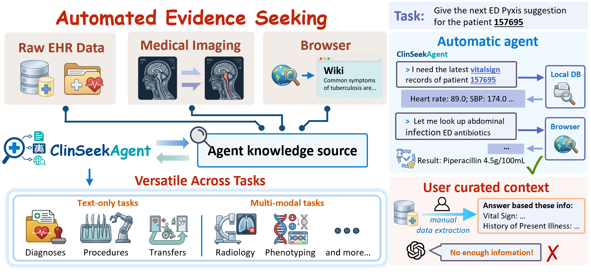
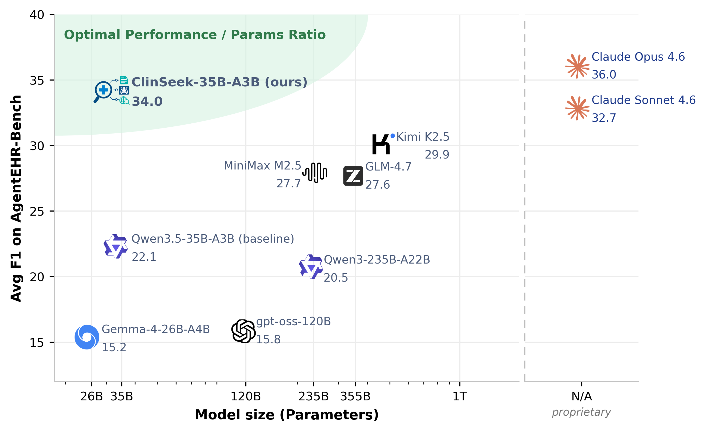

<div align="center">

# 🔎 ClinSeekAgent

**Automating multimodal evidence seeking for agentic clinical reasoning**

[](#install)
[](#repository-layout)
[](#data-artifacts)
[](LICENSE)
<br>
[](https://arxiv.org/abs/2605.20176)
[](https://huggingface.co/collections/UCSC-VLAA/clinseekagent)

🌐 Project page: https://ucsc-vlaa.github.io/ClinSeekAgent/

[Quick Start](#quick-start) • [Data](#data-artifacts) • [Docs](#documentation) • [Training](#sft-training) • [Responsible Use](#responsible-use)

</div>

ClinSeekAgent is a multimodal evidence-seeking pipeline for agentic clinical reasoning. It gives a host model access to patient-level EHR retrieval, browser tools for external medical knowledge, and medical imaging tools, then evaluates the model under the **Automated Evidence-Seeking** setting instead of the paired **Curated Input** setting.

This repository is prepared as the public code release for:

> **[ClinSeekAgent: Automating Multimodal Evidence Seeking for Agentic Clinical Reasoning](https://arxiv.org/abs/2605.20176)**

> [!IMPORTANT]
> This public release intentionally does **not** include raw MIMIC data, generated patient databases, chest X-ray files, private trajectories, model weights, or experiment logs. Data and model artifacts should be released separately on Hugging Face after the relevant access and license checks.

<p align="center">
  
</p>

## 📊 Headline Results

ClinSeekAgent shifts evaluation from passive consumption of pre-selected evidence to *active* evidence acquisition across raw EHR tables, external medical knowledge search, and medical imaging. Compared with the paired **Curated Input** setting (same task, same label, but evidence pre-selected by the source benchmark):

**Text-only EHR tasks (ClinSeek-Bench, overall F1):**

| Host model | Curated Input | ClinSeekAgent | Δ |
| --- | ---: | ---: | ---: |
| Claude Opus 4.6 | 60.0 | **63.2** | **+3.2** |
| MiniMax M2.5 | 43.1 | **47.3** | **+4.2** |

7 / 9 evaluated host models improve on the risk-prediction split.

**Multimodal tasks (ClinSeek-Bench, overall F1):**

| Host model | Curated Input | ClinSeekAgent | Δ |
| --- | ---: | ---: | ---: |
| Claude Opus 4.6 | 47.5 | **62.6** | **+15.1** |
| Claude Sonnet 4.6 | 48.0 | **54.9** | **+6.9** |
| Qwen3-VL-235B | 43.9 | **49.8** | **+5.9** |
| Gemma-4-26B-A4B-it | 38.2 | **44.9** | **+6.7** |

5 / 6 evaluated host models improve overall; on Phenotype reasoning Opus 4.6 alone gains **+34.0 points**.

**Distilled student (AgentEHR-Bench, average F1):**

| Model | Average F1 |
| --- | ---: |
| Qwen3.5-35B-A3B (base) | 22.1 |
| **ClinSeek-35B-A3B (ours, SFT on ClinSeekAgent trajectories)** | **34.0 (+11.9)** |
| Claude Sonnet 4.6 | 32.7 |
| Claude Opus 4.6 (teacher) | 36.0 |

`ClinSeek-35B-A3B` is the strongest open-source model in our evaluation, surpassing Kimi K2.5 (29.9), MiniMax M2.5 (27.7), GLM-4.7 (27.6), and Qwen3-235B-A22B (20.5), while reaching 94.4% of its teacher's performance.

<p align="center">
  
</p>

<a id="repository-layout"></a>
## 🧩 Repository Layout

| Path | Purpose |
| --- | --- |
| `clinseekagent/` | Automated Evidence-Seeking and Curated Input drivers, LLM backends (Bedrock + vLLM), tool pools, and scorers |
| `src/run_mcp_server.py` | EHR MCP server |
| `src/agentlite/mcp_tools/` | EHR table, SQL, candidate, and utility tools |
| `src/mcp_image/` | Medical-image MCP server and image tools |
| `verl/` | Vendored VERL training code and ClinSeekAgent SFT recipes |
| `scripts/` | Public launchers for MCP servers, evaluation, vLLM, and SFT |
| `docs/` | Release, data, benchmark, and training documentation |
| `venvs/requirements/` | Per-role dependency files (agent driver, EHR MCP, image MCP, SFT training) |
| `assets/` | Figures used in this README (teaser, performance plot, case study) |
| `examples/` | Synthetic manifest examples only |

<a id="install"></a>
## ⚙️ Install

ClinSeekAgent is intentionally split into **four roles** with separate dependency files so you only install what you need. The agent driver and the MCP servers should each live in their own venv: the agent driver is a thin HTTP/SDK client, but the MCP servers and SFT training pull in heavy GPU and ML stacks.

```bash
cp .env.example .env   # fill values for the roles you plan to run
```

### 1. Agent driver — `venvs/requirements/bedrock_agent.txt`

Run inference + scoring. No GPU. Install this whether you use Bedrock or a self-hosted vLLM endpoint.

```bash
python -m venv .venvs/agent && source .venvs/agent/bin/activate
pip install -r venvs/requirements/bedrock_agent.txt
```

### 2. EHR MCP server — `venvs/requirements/mcp_ehr.txt`

Serves `ehr.*` tool calls over MCP. GPU optional (used only for BioLORD semantic search). Install only on the host that runs `scripts/run_ehr_mcp.sh`.

```bash
python -m venv .venvs/mcp-ehr && source .venvs/mcp-ehr/bin/activate
# Install a torch build matching your CUDA before pip-installing this file.
pip install torch==2.8.0 --index-url https://download.pytorch.org/whl/cu121
pip install -r venvs/requirements/mcp_ehr.txt
```

### 3. Image MCP server — `venvs/requirements/mcp_image.txt`

Serves `image.*` CXR tool calls (classifier, report generator, phrase grounding, segmentation). **GPU required** (4 GPUs recommended). Install only on the host that runs `scripts/run_image_mcp.sh`.

```bash
python -m venv .venvs/mcp-image && source .venvs/mcp-image/bin/activate
pip install --pre torch==2.9.0+cu128 torchvision==0.24.0+cu128 \
    --index-url https://download.pytorch.org/whl/cu128
pip install -r venvs/requirements/mcp_image.txt
```

> **Important:** the image MCP pins `transformers==4.46.3` to keep MAIRA-2 working. Do not co-install this venv with the agent venv.

### 4. SFT training — `venvs/requirements/sft_training.txt`

Distill ClinSeekAgent trajectories into a smaller student (paper recipe: Qwen3.5-35B-A3B on 8× H200). Install only on the training node.

```bash
python -m venv .venvs/sft && source .venvs/sft/bin/activate
pip install -r venvs/requirements/sft_training.txt
```

See [`docs/sft_training.md`](docs/sft_training.md) for the full paper recipe.

<a id="data-artifacts"></a>
## 📦 Data & Artifacts

Data is not stored in Git. Set `CLINSEEK_DATA_ROOT` to a prepared benchmark tree after obtaining the required credentialed datasets from their official sources.

```bash
export CLINSEEK_DATA_ROOT=./data/clinseek_bench
export CLINSEEK_MODEL_DIR=./models/clinseek-35b-a3b
```

The [ClinSeekAgent Hugging Face collection](https://huggingface.co/collections/UCSC-VLAA/clinseekagent)
contains the released model, benchmark metadata, and evaluation-result
artifacts:

- 🧪 ClinSeek-Bench data: [`UCSC-VLAA/ClinSeek-Bench`](https://huggingface.co/datasets/UCSC-VLAA/ClinSeek-Bench)
- 🤖 ClinSeek-35B-A3B model checkpoint: [`UCSC-VLAA/ClinSeek-35B-A3B`](https://huggingface.co/UCSC-VLAA/ClinSeek-35B-A3B)
- 📊 Evaluation results: [`UCSC-VLAA/ClinSeek-Evaluation-Results`](https://huggingface.co/datasets/UCSC-VLAA/ClinSeek-Evaluation-Results)

See [`RESOURCES.md`](RESOURCES.md) and the documentation below for access notes and expected release structure.

<a id="documentation"></a>
## 📖 Documentation

For the text-only split of **ClinSeek-Bench**, use the following release guides:

- [`docs/ClinSeek-Bench_text_data_prepare.md`](docs/ClinSeek-Bench_text_data_prepare.md): prepare the patient-level EHR assets used by ClinSeekAgent, including MIMIC-IV / MIMIC-IV-Note / MIMIC-IV-ED layout and per-patient SQLite database generation.
- [`docs/ClinSeek-Bench_text_evaluation.md`](docs/ClinSeek-Bench_text_evaluation.md): run ClinSeekAgent under the **Automated Evidence-Seeking** setting, where the model retrieves evidence from raw EHR tables through ClinSeekAgent tools.
- [`docs/ClinSeek-Bench_text_curated_input_evaluation.md`](docs/ClinSeek-Bench_text_curated_input_evaluation.md): run the paired **Curated Input** baseline, where the model answers from the benchmark-provided evidence package without tool access.

<a id="quick-start"></a>
## 🚀 Quick Start

Start an EHR MCP server:

```bash
bash scripts/run_ehr_mcp.sh
```

Run a text-only evaluation file:

```bash
DATA_PATH=examples/synthetic_text_sample.jsonl \
OUTPUT_DIR=outputs/text_smoke \
bash scripts/run_text_eval.sh
```

For multimodal runs, start the image MCP server and provide a manifest whose image paths resolve under `BENCH_ROOT`:

```bash
bash scripts/run_image_mcp.sh

DATA_PATH=examples/synthetic_multimodal_sample.jsonl \
OUTPUT_DIR=outputs/mm_smoke \
bash scripts/run_mm_eval.sh
```

The example files are schema examples, not a replacement for the benchmark data.

<a id="supported-workflows"></a>
## 🧪 Supported Workflows

- ✨ **Automated Evidence-Seeking text-only evaluation** over patient-level EHR tables and candidate sets.
- 🩻 **Multimodal evaluation** that combines EHR evidence with linked chest X-ray inputs.
- 🧠 **Curated Input baselines** for comparing pre-selected evidence against tool-mediated evidence seeking.
- 🛠️ **MCP tool serving** for EHR tables, SQL-style access, candidates, image inputs, and utility tools.
- 📚 **SFT data preparation and training recipes** using the vendored `verl/` training code.

<a id="sft-training"></a>
## 🏋️ SFT Training

Prepare trajectory parquet files:

```bash
python verl/examples/sft/clinseek/prepare_clinseek_data.py \
  --repo_id <hf-org-or-user>/<trajectory-dataset> \
  --filename clinseek_trajectories.jsonl \
  --model_name Qwen/Qwen3.5-35B-A3B \
  --max_token_length 52000 \
  --output_dir data/clinseek_trajectory_qwen35_52k
```

Run SFT with the vendored VERL training code:

```bash
TRAIN_FILES=data/clinseek_trajectory_qwen35_52k/train.parquet \
VAL_FILES=data/clinseek_trajectory_qwen35_52k/val.parquet \
MODEL_PATH=./models/Qwen3.5-35B-A3B \
bash scripts/train_sft.sh
```

More details are in [`docs/sft_training.md`](docs/sft_training.md).

<a id="responsible-use"></a>
## ⚠️ Responsible Use

ClinSeekAgent is for research on clinical evidence seeking. It is not a medical device and must not be used for clinical diagnosis, treatment, triage, or patient management without separate validation, governance, and regulatory review.

<a id="citation"></a>
## 📚 Citation

If you use ClinSeekAgent, ClinSeek-Bench, or ClinSeek-35B-A3B, please cite:

```bibtex
@misc{wu2026clinseekagent,
  title        = {ClinSeekAgent: Automating Multimodal Evidence Seeking for Agentic Clinical Reasoning},
  author       = {Wu, Juncheng and Zhang, Letian and Wang, Yuhan and Tu, Haoqin and Chen, Hardy and Wang, Zijun and Xie, Cihang and Zhou, Yuyin},
  year         = {2026},
  eprint       = {2605.20176},
  archivePrefix = {arXiv},
  primaryClass = {cs.CL},
  url          = {https://arxiv.org/abs/2605.20176}
}
```
