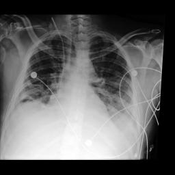

# Case 2 — MM phenotyping: CXR vision + SQL + taxonomy lookup

**qid:** `medmod_phenotyping_test_38131454_130.604444` · **task:** `medmod_phenotyping`
**gold:** `[{'name': 'Complications of surgical procedures or medical care'}, {'name': 'Fluid and electrolyte disorders'}, {'name': 'Pneumonia (except that caused by tuberculosis or sexually transmitted disease)'}, {'name': 'Septicemia (except in labor)'}, {'name': 'Shock'}]`

- **ClinSeek final** ✅: `['Septicemia (except in labor)', 'Shock', 'Pleurisy; pneumothorax; pulmonary collapse', 'Pneumonia (except that caused by tuberculosis or sexually transmitted disease)', 'Respiratory failure; insufficiency; arrest (adult)', 'Fluid and electrolyte disorders', 'Complications of surgical procedures or medical care']` (tool calls = 102, messages = 196)
- **Reasoning final** ❌: `['Atelectasis', 'Pleural Effusion', 'Support Devices']` (tool calls = 1, messages = 3)

## Tool-call distribution

**ClinSeek:**
```
  ehr.run_sql_query                        45
  browser.open                             14
  ehr.think                                9
  browser.find                             8
  browser.search                           7
  ehr.get_column_names                     5
  ehr.get_records_by_keyword               4
  ehr.get_candidates_by_keyword            3
  ehr.get_unique_values                    2
  ehr.load_ehr                             1
  image.chest_xray_classifier              1
  image.chest_xray_report_generator        1
  ehr.get_table_names                      1
  ehr.finish                               1
```

**Reasoning pipeline:**
```
  ehr.finish                               1
```

## Why the paradigms diverge

- Reasoning-mode prompt has the raw `tb_cxr` / `events` metadata and the linked CXR jpg, but no access to image tools, raw events rows, or the 25-phenotype taxonomy.
- ClinSeek (Opus) ran 196 messages using `image.chest_xray_classifier`, `image.chest_xray_report_generator`, 45 SQL queries on `events`, and 11 browser calls that recovered the Harutyunyan-2019 CCS label space.
- Scouting calls explored table schemas, output events, trach/chest tube history, skin assessments, lung sounds, edema, stool/GI findings, and browsed web for phenotype definitions. Most were exploratory or confirmatory without yielding decisive new evidence.

## Vital ClinSeek tool calls (the calls that determined the agent's answer)

### 1. Call #11: `ehr.run_sql_query` — Vital signs: HR >100 (tachycardia), MAP as low as 52, fevers up to 40°C

**Why this call determined the answer:** Identified sepsis/shock indicators: tachycardia, hypotension, fever

_Tool call:_ `ehr.run_sql_query({"subject_id": "12183714", "sql_query": "SELECT DISTINCT label, value, valuenum, charttime FROM events WHERE label IN ('heart rate', 'respiratory rate', 'non invasive blood pressure systolic', 'non invasive blood pressure diastolic', 'non invasive blood pressure mean', 'art bp systolic', 'art bp diastolic', 'art bp mean', 'temperature celsius', 'o2 saturation pulseoxymetry', 'inspired o2 fraction', 'ventilator mode', 'peep set', 'tidal volume (set)', 'tidal volume (observed)', 'respiratory rate (set)', 'respiratory rate (total)', 'wbc', 'platelet count', 'hemoglobin', 'hematocrit (serum)', 'creatinine (serum)', 'bun', 'potassium (serum)', 'sodium (serum)', 'chloride (serum)', 'hco3 (serum)', 'glucose (serum)', 'total bilirubin', 'inr', 'ptt', 'lactic acid', 'ph (arterial)', 'arterial o2 pressure', 'arterial co2 pressure', 'arterial o2 saturation', 'arterial base excess', 'anion gap', 'albumin', 'ionized calcium', 'magnesium', 'phosphorous', 'gcs - eye opening', 'gcs - motor response', 'gcs - verbal response') ORDER BY charttime DESC LIMIT 200"})`

_Tool result:_
```
                                label          value valuenum           charttime
                           heart rate             97       97 2166-08-01 03:00:00
 non invasive blood pressure systolic            111      111 2166-08-01 03:00:00
non invasive blood pressure diastolic             70       70 2166-08-01 03:00:00
     non invasive blood pressure mean             78       78 2166-08-01 03:00:00
                     respiratory rate             18       18 2166-08-01 03:00:00
          o2 saturation pulseoxymetry            100      100 2166-08-01 03:00:00
                           heart rate            112      112 2166-08-01 02:00:00
 non invasive blood pressure systolic             94       94 2166-08-01 02:00:00
non invasive blood pressure diastolic             54       54 2166-08-01 02:00:00
     non invasive blood pressure mean             63       63 2166-08-01 02:00:00
                     respiratory rate             21       21 2166-08-01 02:00:00
          o2 saturation pulseoxymetry             95       95 2166-08-01 02:00:00
                           heart rate            101      101 2166-08-01 01:00:00
 non invasive blood pressure systolic            120      120 2166-08-01 01:00:00
non invasive blood pressure diastolic             75       75 2166-08-01 01:00:00
     non invasive blood pressure mean             84       84 2166-08-01 01:00:00
      
…[truncated 15081 chars]
```

### 2. Call #27: `ehr.run_sql_query` — Vancomycin trough levels 9.2-11.3 during stay, confirming IV antibiotic treatment

**Why this call determined the answer:** Confirmed active infection treatment supporting septicemia phenotype

_Tool call:_ `ehr.run_sql_query({"subject_id": "12183714", "sql_query": "SELECT label, value, valuenum, charttime FROM events WHERE label IN ('vancomycin (trough)', 'vancomycin (random)', 'tobramycin (random)') AND charttime >= '2166-07-26 00:00:00' ORDER BY charttime DESC"})`

_Tool result:_
```
              label value valuenum           charttime
vancomycin (trough)  10.8     10.8 2166-07-29 22:53:00
vancomycin (trough)  11.3     11.3 2166-07-28 18:59:00
vancomycin (trough)   9.2      9.2 2166-07-27 18:25:00
```

### 3. Call #29: `ehr.run_sql_query` — Labs: low albumin 2.1-2.2, low Hgb 7.5-10, low platelets, elevated lactate 2.2

**Why this call determined the answer:** Identified fluid/electrolyte disorders, organ dysfunction markers

_Tool call:_ `ehr.run_sql_query({"subject_id": "12183714", "sql_query": "SELECT label, value, valuenum, charttime FROM events WHERE label IN ('creatinine (serum)', 'bun', 'hemoglobin', 'hematocrit (serum)', 'wbc', 'platelet count', 'inr', 'ptt', 'total bilirubin', 'direct bilirubin', 'albumin', 'lactic acid', 'anion gap', 'hco3 (serum)', 'glucose (serum)', 'ph (arterial)', 'arterial o2 pressure', 'arterial co2 pressure') AND charttime >= '2166-07-26 00:00:00' ORDER BY label, charttime"})`

_Tool result:_
```
             label value valuenum           charttime
           albumin   2.1      2.1 2166-07-28 03:13:00
           albumin   2.2      2.2 2166-07-29 02:15:00
         anion gap    12       12 2166-07-26 20:30:00
         anion gap    13       13 2166-07-27 03:49:00
         anion gap    11       11 2166-07-28 03:13:00
         anion gap    12       12 2166-07-28 18:59:00
         anion gap    12       12 2166-07-29 02:15:00
         anion gap    11       11 2166-07-29 15:30:00
         anion gap    11       11 2166-07-30 02:13:00
         anion gap     9        9 2166-07-30 03:48:00
         anion gap    10       10 2166-07-30 05:42:00
         anion gap     6        6 2166-07-30 08:30:00
         anion gap    10       10 2166-07-30 12:50:00
         anion gap    10       10 2166-07-31 04:02:00
               bun    12       12 2166-07-26 20:30:00
               bun    11       11 2166-07-27 03:49:00
               bun    10       10 2166-07-28 03:13:00
               bun     7        7 2166-07-28 18:59:00
               bun     9        9 2166-07-29 02:15:00
               bun    10       10 2166-07-29 15:30:00
               bun     9        9 2166-07-30 02:13:00
               bun     9        9 2166-07-30 03:48:00
               bun     8        8 2166-07-30 05:42:00
               bun     6        6 2166-07-30 08:30:00
               bun     7        7 2166-07-30 12:50
…[truncated 3945 chars]
```

### 4. Call #30: `ehr.run_sql_query` — Fevers: 40°C on 7/26, 103.8°F on 7/27, 102°F on 7/28

**Why this call determined the answer:** Confirmed high fevers supporting septicemia diagnosis

_Tool call:_ `ehr.run_sql_query({"subject_id": "12183714", "sql_query": "SELECT label, value, valuenum, charttime FROM events WHERE label IN ('temperature celsius', 'temperature fahrenheit') AND charttime >= '2166-07-26 00:00:00' AND (valuenum > 100.4 OR (label = 'temperature celsius' AND valuenum > 38.0)) ORDER BY charttime"})`

_Tool result:_
```
                 label value valuenum           charttime
temperature fahrenheit  98.2     98.2 2166-07-26 17:43:00
temperature fahrenheit 101.8    101.8 2166-07-26 20:00:00
   temperature celsius    40       40 2166-07-26 23:25:00
   temperature celsius  39.3     39.3 2166-07-27 00:00:00
   temperature celsius  38.4     38.4 2166-07-27 01:00:00
   temperature celsius  37.9     37.9 2166-07-27 02:00:00
   temperature celsius  37.9     37.9 2166-07-27 03:00:00
   temperature celsius  37.9     37.9 2166-07-27 04:00:00
   temperature celsius    38       38 2166-07-27 05:00:00
   temperature celsius  38.2     38.2 2166-07-27 06:00:00
temperature fahrenheit  98.9     98.9 2166-07-27 08:09:00
   temperature celsius  37.2     37.2 2166-07-27 10:00:00
temperature fahrenheit  98.2     98.2 2166-07-27 12:00:00
temperature fahrenheit  99.8     99.8 2166-07-27 16:00:00
temperature fahrenheit 103.8    103.8 2166-07-27 20:00:00
temperature fahrenheit 102.8    102.8 2166-07-27 22:00:00
temperature fahrenheit 101.2    101.2 2166-07-28 00:00:00
temperature fahrenheit  99.4     99.4 2166-07-28 04:00:00
temperature fahrenheit  99.8     99.8 2166-07-28 06:00:00
temperature fahrenheit  98.2     98.2 2166-07-28 08:00:00
temperature fahrenheit  99.3     99.3 2166-07-28 12:00:00
temperature fahrenheit  99.7     99.7 2166-07-28 16:00:00
temperature fahrenheit 101.3    101.3 2166-07-28 20:00:00
temperat
…[truncated 1093 chars]
```

### 5. Call #43: `ehr.run_sql_query` — MAP <65 on many occasions (down to 51), persistent hypotension

**Why this call determined the answer:** Confirmed shock phenotype based on sustained hypotension

_Tool call:_ `ehr.run_sql_query({"subject_id": "12183714", "sql_query": "SELECT label, value, charttime FROM events WHERE label LIKE '%blood pressure%' AND charttime >= '2166-07-26 00:00:00' AND valuenum < 65 AND label LIKE '%mean%' ORDER BY charttime DESC LIMIT 30"})`

_Tool result:_
```
                           label value           charttime
non invasive blood pressure mean    63 2166-08-01 02:00:00
non invasive blood pressure mean    59 2166-07-31 20:00:00
non invasive blood pressure mean    64 2166-07-31 17:00:00
non invasive blood pressure mean    63 2166-07-31 14:00:00
non invasive blood pressure mean    62 2166-07-31 11:00:00
non invasive blood pressure mean    63 2166-07-31 10:00:00
non invasive blood pressure mean    55 2166-07-31 09:00:00
non invasive blood pressure mean    62 2166-07-31 08:00:00
non invasive blood pressure mean    61 2166-07-31 07:00:00
non invasive blood pressure mean    62 2166-07-31 06:00:00
non invasive blood pressure mean    60 2166-07-31 05:00:00
non invasive blood pressure mean    52 2166-07-31 04:00:00
non invasive blood pressure mean    53 2166-07-31 03:00:00
non invasive blood pressure mean    61 2166-07-31 02:13:00
non invasive blood pressure mean    51 2166-07-31 01:23:00
non invasive blood pressure mean    52 2166-07-31 00:19:00
non invasive blood pressure mean    57 2166-07-30 23:09:00
non invasive blood pressure mean    60 2166-07-30 22:04:00
non invasive blood pressure mean    58 2166-07-30 21:30:00
non invasive blood pressure mean    60 2166-07-30 18:29:00
non invasive blood pressure mean    59 2166-07-30 05:00:00
non invasive blood pressure mean    52 2166-07-30 01:30:00
non invasive blood pressure mean    60 2166
…[truncated 428 chars]
```

### 6. Call #77: `browser.open` — 25 HCUP CCS phenotype categories listed including septicemia, shock, complications

**Why this call determined the answer:** Identified correct phenotype vocabulary from Harutyunyan benchmark

_Tool call:_ `browser.open({"loc": 514, "num_lines": 50, "cursor": 18})`

_Tool result:_
```
[20] aclanthology.org (https://aclanthology.org/anthology-files/anthology-files/pdf/acl/2024.acl-short.68.pdf)
**viewing lines [514 - 563] of 650**

L514: at AppendixASingleDX.txt 762 �Table 3: The 25 pre-defined phenotypes in MIMIC-
L515: III. sive controlled collection for indexing jour- nal articles and books in the
L516:  life sciences. Phenotype Type It organizes information on biomedical and Acute 
L517: and unspecifed renal failure acute health-related topics into a hierarchical 
L518: struc- Acute cerebrovascular disease acute Acute myocardial infarction acute 
L519: ture. The corpus contains 32.5k documents Cardiac dysrhythmias mixed covering 
L520: various medical concepts. Chronic kidney disease chronic Chronic obstructive 
L521: pulmonary disease chronic Complications of surgical/medical care acute * 
L522: Wikipedia11 (Vrandecic and Krotzsch, 2014): Conduction disorders mixed Wikipedia
L523:  is a free, web-based, collabora- Congestive heart failure; nonhypertensive 
L524: mixed Coronary atherosclerosis and related chronic tive, multilingual 
L525: encyclopedia project that is Diabetes mellitus with complications mixed 
L526: supported by the non-profit Wikimedia Foun- Diabetes mellitus without 
L527: complication chronic dation. We extract web pages that contain Disorders of 
L528: lipid metabolism chronic Essential hypertension chronic medical-related 
L529: info
…[truncated 2897 chars]
```

### 7. Call #80: `ehr.get_candidates_by_keyword` — Matched 'Septicemia (except in labor)' CCS candidate

**Why this call determined the answer:** Confirmed exact phenotype name for septicemia

_Tool call:_ `ehr.get_candidates_by_keyword({"table_name": "diagnoses_ccs_candidates", "keyword": "septic"})`

_Tool result:_
```
icd_code icd_version                    candidate  similarity_score
    0031           9 Septicemia (except in labor)                12
```

### 8. Call #31: `ehr.run_sql_query` — Patient has colostomy/ileostomy, indicating prior surgical procedure

**Why this call determined the answer:** Supported 'Complications of surgical procedures or medical care' phenotype

_Tool call:_ `ehr.run_sql_query({"subject_id": "12183714", "sql_query": "SELECT label, value, valuenum, charttime FROM events WHERE label LIKE '%ostomy%' AND charttime >= '2166-07-26 00:00:00' ORDER BY charttime LIMIT 20"})`

_Tool result:_
```
            label     value valuenum           charttime
           ostomy Colostomy      NaN 2166-07-26 18:03:00
ostomy appearance      Pink      NaN 2166-07-26 18:03:00
           ostomy Colostomy      NaN 2166-07-26 20:00:00
ostomy appearance      Pink      NaN 2166-07-26 20:00:00
  ostomy (output)       250       mL 2166-07-26 21:00:00
  ostomy (output)        75       mL 2166-07-26 23:00:00
           ostomy Colostomy      NaN 2166-07-27 00:00:00
ostomy appearance      Pink      NaN 2166-07-27 00:00:00
  ostomy (output)       150       mL 2166-07-27 05:00:00
  ostomy (output)        50       mL 2166-07-27 08:00:00
  ostomy (output)        75       mL 2166-07-27 10:00:00
  ostomy (output)        50       mL 2166-07-27 16:00:00
  ostomy (output)       250       mL 2166-07-27 19:00:00
           ostomy Ileostomy      NaN 2166-07-27 20:00:00
ostomy appearance      Pink      NaN 2166-07-27 20:00:00
  ostomy (output)        75       mL 2166-07-27 23:00:00
           ostomy Ileostomy      NaN 2166-07-28 00:00:00
  ostomy (output)       125       mL 2166-07-28 05:00:00
           ostomy Ileostomy      NaN 2166-07-28 08:00:00
ostomy appearance      Pink      NaN 2166-07-28 08:00:00
```

## ClinSeek final `ehr.think` synthesis (tail)
```
he bilateral pulmonary metastases on CXR)
2. Admitted with high fevers (40°C), tachycardia, hypotension → sepsis picture
3. On IV vancomycin → treating infection/sepsis
4. CXR: bilateral pleural effusions, bilateral pulmonary nodules (mets), low lung volumes, diffuse reticular pattern
5. Supplemental O2 needed initially (nasal cannula 2L), then weaned off
6. Electrolyte disturbance: hyperchloremia
7. Persistent hypotension (MAP frequently <65)
8. Diminished bilateral lower lobe lung sounds

Final determination of applicable phenotype groups from the 25 benchmark phenotypes:

1. **Septicemia (except in labor)** - YES. High fevers, tachycardia, hypotension, IV antibiotics (vancomycin), MICU admission, neutrophilia. Classic sepsis presentation.

2. **Shock** - YES. Persistent MAP < 65 on numerous occasions throughout stay. In the context of septicemia, this would be septic shock. Even though vasopressors aren't documented in chartevents, the persistent hypotension combined with sepsis warrants shock coding.

3. **Pleurisy; pneumothorax; pulmonary collapse** - YES. CXR shows bilateral pleural effusions. Atelectasis (low lung volumes, diminished bilateral lower lobe sounds). CXR classifier atelectasis probability 0.69.

4. **Pneumonia** - YES. CXR shows diffuse reticular pattern (possible infection), consolidation probability 0.62. Patient febrile with IV antibiotics. Rhonchi in lower lobes. Neutrophilia.

5. **Respiratory failure; insufficiency; arrest** - YES. Required supplemental O2. CXR shows bilateral opacities, effusions, low lung volumes. History of tracheostomy/mechanical ventilation. Diminished bilateral lower lobe sounds.

6. **Fluid and electrolyte disorders** - YES. Hyperchloremia (Cl 109-113). Hypoalbuminemia (2.1-2.2). Right leg edema.

7. **Complications of surgical procedures or medical care** - YES. Ileostomy/colostomy management, abdominal surgical incision, drain sites, central line.

Let me consider if there are others I might be missing:
- Cardiac dysrhythmias: Sinus tachycardia is documented but is typically a physiologic response. Unlikely to be coded.
- Other lower respiratory disease: This is a catch-all but the specific conditions (pleural effusion, pneumonia, respiratory failure) already covered above.
- Congestive heart failure: No direct evidence despite effusions (more likely from sepsis/infection).

I'll go with these 7 phenotypes.
```

## Linked chest-X-ray image(s) (what the model saw)



## Why reasoning mode got it wrong

**Reasoning-mode prediction:** `['Atelectasis', 'Pleural Effusion', 'Support Devices']`

**Failure type:** `missing_evidence_in_prompt`

**Where it went wrong:** The reasoning model only saw the last 80 chart events (mostly recent vitals near discharge) and the CXR. It lacked earlier vital signs showing fevers/hypotension, lab values (lactate, WBC, albumin, electrolytes), vancomycin levels, and the HCUP CCS phenotype vocabulary. It defaulted to radiographic findings only.

**Missed evidence:** Earlier fevers (40°C), persistent MAP<65, vancomycin treatment, lab values (lactate, electrolytes, albumin), ostomy/surgical history, and the 25 HCUP CCS phenotype category names were all absent from the curated prompt.

**Pull quote from the reasoning reply:**

> Tachycardia: Multiple episodes of sinus tachycardia (HR >100) ... Central line (multi-lumen): In place, confirmed by X-ray ... Gastric tube: Significant output (600 mL x2)

## Full reasoning-mode output
```
I'll analyze the patient's EHR data and chest X-ray systematically to identify all applicable phenotype groups.

**Patient Demographics:** 35-year-old Hispanic/Latino male, admitted to MICU/SICU on 2166-07-26.

**Vital Signs Analysis (recent):**
- Heart rate: 97-114 (tachycardic episodes, sinus tachycardia noted)
- Blood pressure: systolic 94-120, diastolic 54-75 (some hypotensive episodes)
- Respiratory rate: 18-24 (elevated)
- SpO2: 95-100%
- CVP: 2-7 (low)

**Key Clinical Findings:**
- **Tachycardia:** Multiple episodes of sinus tachycardia (HR >100)
- **Central line (multi-lumen):** In place, confirmed by X-ray
- **Foley catheter:** Active urine output monitoring
- **Gastric tube:** Significant output (600 mL x2)
- **Ostomy:** Active output (250-425 mL) - suggests prior abdominal surgery
- **Diminished lung sounds:** RLL and LLL bilaterally
- **No mechanical ventilation** at current time (no vent settings visible, room air/no O2 device)
- **Extensive prior ICU history:** Multiple prior admissions with many CXRs

**Chest X-ray Analysis (study 54270131, 2166-07-30):**
- AP portable film
- Central venous catheter visible
- Nasogastric tube present
- Bilateral lower lobe opacities/atelectasis
- Possible pleural effusions
- Support devices in place

**Phenotype Groups:**

1. **Atelectasis** - Diminished bilateral lower lobe lung sounds, CXR findings
2. **Pleural Effusion** - CXR shows bilateral lower zone opacities
3. **Support Devices** - Central line, NGT, Foley all present
4. **Tachycardia/Arrhythmia** - Recurrent sinus tachycardia (HR >100)

<answer>
Atelectasis
Pleural Effusion
Support Devices
</answer>
```