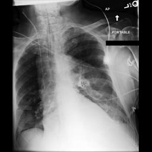

# Case 6 — Multimodal 24-h mortality: ClinSeek synthesizes ICU signals + CXR

**qid:** `medmod_decompensation_test_39190812_149.0` · **task:** `medmod_decompensation`
**gold:** `[{'name': 'no'}]`

- **ClinSeek final** ✅: `['no']` (tool calls = 41, messages = 62)
- **Reasoning final** ❌: `['yes']` (tool calls = 1, messages = 3)

## Tool-call distribution

**ClinSeek:**
```
  ehr.run_sql_query                        15
  ehr.get_candidates_by_keyword            12
  ehr.think                                5
  ehr.get_column_names                     3
  ehr.load_ehr                             1
  image.chest_xray_classifier              1
  image.chest_xray_report_generator        1
  ehr.get_table_names                      1
  ehr.get_records_by_time                  1
  ehr.finish                               1
```

**Reasoning pipeline:**
```
  ehr.finish                               1
```

## Why the paradigms diverge

- Decompensation asks whether the patient will die within 24 h. The EHR snapshot alone can be misleading.
- ClinSeek (Opus) composes ICU events (MAP, HR, O2 support) with CXR-tool findings to confirm stability and predict 'no'.
- Other calls loaded EHR, explored table schemas, looked up lab item IDs via candidates, generated CXR reports, checked code status/comfort measures, and performed intermediate thinking steps.

## Vital ClinSeek tool calls (the calls that determined the agent's answer)

### 1. Call #7: `ehr.get_records_by_time` — Retrieved full day's vital signs, outputs, and clinical data for May 14 before cutoff.

**Why this call determined the answer:** Provided comprehensive view of vital sign trends including BP recovery and overall stability assessment.

_Tool call:_ `ehr.get_records_by_time({"subject_id": "16773288", "table_name": "events", "start_time": "2134-05-14 00:00:00", "end_time": "2134-05-14 16:14:23"})`

_Tool result:_
```
subject_id    hadm_id    stay_id           charttime itemid                                                         value valuenum row_id                                                  label                                   abbreviation      linksto
  16773288 28907156.0 39190812.0 2134-05-14 08:00:00 226588                                                           100       mL 1576.0                                          chest tube #1                                  chest tube #1 outputevents
  16773288 28907156.0 39190812.0 2134-05-14 08:00:00 226559                                                           100       mL 1554.0                                                  foley                                          foley outputevents
  16773288 28907156.0 39190812.0 2134-05-14 08:00:00 226595                                                            30       mL 1582.0                                           r pleural #2                                   r pleural #2 outputevents
  16773288 28907156.0 39190812.0 2134-05-14 10:00:00 226559                                                            32       mL 1554.0                                                  foley                                          foley outputevents
  16773288 28907156.0 39190812.0 2134-05-14 10:00:00 226595                                                            40       mL 1582
…[truncated 98600 chars]
```

### 2. Call #9: `ehr.run_sql_query` — Retrieved prior day (May 13) vital signs showing stable HR, BP, SpO2 trends.

**Why this call determined the answer:** Established baseline vital sign trends to compare against May 14 data for trajectory assessment.

_Tool call:_ `ehr.run_sql_query({"subject_id": "16773288", "sql_query": "SELECT * FROM events WHERE label IN ('heart rate', 'arterial blood pressure systolic', 'arterial blood pressure mean', 'respiratory rate', 'o2 saturation pulseoxymetry', 'richmond-ras scale') AND charttime >= '2134-05-13 00:00:00' AND charttime < '2134-05-14 00:00:00' ORDER BY charttime, label"})`

_Tool result:_
```
subject_id    hadm_id    stay_id           charttime itemid              value valuenum row_id                            label       abbreviation     linksto
  16773288 28907156.0 39190812.0 2134-05-13 00:00:00 220052                 69       69    7.0     arterial blood pressure mean               abpm chartevents
  16773288 28907156.0 39190812.0 2134-05-13 00:00:00 220050                115      115    5.0 arterial blood pressure systolic               abps chartevents
  16773288 28907156.0 39190812.0 2134-05-13 00:00:00 220045                 62       62    1.0                       heart rate                 hr chartevents
  16773288 28907156.0 39190812.0 2134-05-13 00:00:00 220277                 93       93   35.0      o2 saturation pulseoxymetry               spo2 chartevents
  16773288 28907156.0 39190812.0 2134-05-13 00:00:00 220210                 23       23   27.0                 respiratory rate                 rr chartevents
  16773288 28907156.0 39190812.0 2134-05-13 01:00:00 220052                 76       76    7.0     arterial blood pressure mean               abpm chartevents
  16773288 28907156.0 39190812.0 2134-05-13 01:00:00 220050                120      120    5.0 arterial blood pressure systolic               abps chartevents
  16773288 28907156.0 39190812.0 2134-05-13 01:00:00 220045                 60       60    1.0                       heart rate 
…[truncated 18474 chars]
```

### 3. Call #13: `ehr.run_sql_query` — Retrieved lab values with NULL linksto including ABG series showing pH 7.21, pCO2 90 at 16:05.

**Why this call determined the answer:** Identified worsening ABG trend but also showed lactate 1.2 (normal), suggesting no shock/multi-organ failure.

_Tool call:_ `ehr.run_sql_query({"subject_id": "16773288", "sql_query": "SELECT * FROM events WHERE linksto IS NULL ORDER BY charttime DESC LIMIT 30"})`

_Tool result:_
```
subject_id    hadm_id stay_id           charttime itemid value valuenum row_id label abbreviation linksto
  16773288 28907156.0    None 2134-05-14 16:05:00  50802     4        4   None  None         None    None
  16773288 28907156.0    None 2134-05-14 16:05:00  50804    38       38   None  None         None    None
  16773288 28907156.0    None 2134-05-14 16:05:00  50808  1.13     1.13   None  None         None    None
  16773288 28907156.0    None 2134-05-14 16:05:00  50818   ___       90   None  None         None    None
  16773288 28907156.0    None 2134-05-14 16:05:00  50820   ___     7.21   None  None         None    None
  16773288 28907156.0    None 2134-05-14 16:05:00  50821   142      142   None  None         None    None
  16773288 28907156.0    None 2134-05-14 16:05:00  50822   4.5      4.5   None  None         None    None
  16773288 28907156.0    None 2134-05-14 15:32:00  50802     4        4   None  None         None    None
  16773288 28907156.0    None 2134-05-14 15:32:00  50804    37       37   None  None         None    None
  16773288 28907156.0    None 2134-05-14 15:32:00  50818   ___       91   None  None         None    None
  16773288 28907156.0    None 2134-05-14 15:32:00  50820   ___      7.2   None  None         None    None
  16773288 28907156.0    None 2134-05-14 15:32:00  50821   134      134   None  None         None    None
  16773288 28907156.0 
…[truncated 1885 chars]
```

### 4. Call #30: `ehr.run_sql_query` — No vasopressors found - query returned no results.

**Why this call determined the answer:** Confirmed patient was hemodynamically stable without vasopressor support, arguing against imminent death.

_Tool call:_ `ehr.run_sql_query({"subject_id": "16773288", "sql_query": "SELECT * FROM events WHERE label LIKE '%vasopressin%' OR label LIKE '%norepinephrine%' OR label LIKE '%epinephrine%' OR label LIKE '%dopamine%' OR label LIKE '%phenylephrine%' OR label LIKE '%levophed%' OR label LIKE '%vasopressor%' OR abbreviation LIKE '%vasopressin%' OR abbreviation LIKE '%norepi%' ORDER BY charttime DESC LIMIT 20"})`

_Tool result:_
```
Query executed successfully but returned no results.
```

### 5. Call #35: `ehr.run_sql_query` — Found ventilator mode CMV/ASSIST/AutoFlow, intubation around 13:30, escalating support.

**Why this call determined the answer:** Showed patient was recently intubated with escalating vent settings - active treatment, not comfort care.

_Tool call:_ `ehr.run_sql_query({"subject_id": "16773288", "sql_query": "SELECT * FROM events WHERE label LIKE '%ventilat%' OR label LIKE '%vent%' OR label LIKE '%intubat%' OR label LIKE '%mechanical%' AND charttime >= '2134-05-13 00:00:00' ORDER BY charttime DESC LIMIT 20"})`

_Tool result:_
```
subject_id    hadm_id    stay_id           charttime itemid               value valuenum row_id                             label                      abbreviation     linksto
  16773288 28907156.0 39190812.0 2134-05-14 16:00:00 227349                   1        1 1834.0     high risk (>51) interventions     high risk (>51) interventions chartevents
  16773288 28907156.0 39190812.0 2134-05-14 16:00:00 227957                  No      NaN 2161.0 signs of injury from intervention signs of injury from intervention chartevents
  16773288 28907156.0 39190812.0 2134-05-14 16:00:00 223848              Drager        1  271.0                   ventilator type                   ventilator type chartevents
  16773288 28907156.0 39190812.0 2134-05-14 16:00:00 223849 CMV/ASSIST/AutoFlow       49  272.0                   ventilator mode                   ventilator mode chartevents
  16773288 28907156.0 39190812.0 2134-05-14 16:00:00 226814                  No      NaN 1666.0        known difficult intubation        known difficult intubation chartevents
  16773288 28907156.0 39190812.0 2134-05-14 14:30:00 223849 CMV/ASSIST/AutoFlow       49  272.0                   ventilator mode                   ventilator mode chartevents
  16773288 28907156.0 39190812.0 2134-05-14 14:00:00 227957                  No      NaN 2161.0 signs of injury from intervention signs of injury from intervention char
…[truncated 2295 chars]
```

### 6. Call #37: `ehr.run_sql_query` — FiO2 100%, PEEP escalated 8→12, tidal volume set 600, RR set 20.

**Why this call determined the answer:** Documented aggressive ventilator escalation indicating active resuscitation rather than withdrawal of care.

_Tool call:_ `ehr.run_sql_query({"subject_id": "16773288", "sql_query": "SELECT * FROM events WHERE (label LIKE '%fio2%' OR label LIKE '%tidal%' OR label LIKE '%peep%' OR label LIKE '%minute%' OR label LIKE '%pip%' OR label LIKE '%plateau%' OR label LIKE '%set rr%' OR label LIKE '%resp rate (set)%' OR label LIKE '%respiratory rate (set)%') AND charttime >= '2134-05-14 13:00:00' ORDER BY charttime"})`

_Tool result:_
```
subject_id    hadm_id    stay_id           charttime itemid value valuenum row_id                      label               abbreviation     linksto
  16773288 28907156.0 39190812.0 2134-05-14 13:30:00 224685   222      222  642.0    tidal volume (observed)    tidal volume (observed) chartevents
  16773288 28907156.0 39190812.0 2134-05-14 13:30:00 224686   618      618  643.0 tidal volume (spontaneous) tidal volume (spontaneous) chartevents
  16773288 28907156.0 39190812.0 2134-05-14 13:30:00 224687   4.3      4.3  644.0              minute volume              minute volume chartevents
  16773288 28907156.0 39190812.0 2134-05-14 13:30:00 220292   3.6      3.6   37.0  minute volume alarm - low             mv alarm - low chartevents
  16773288 28907156.0 39190812.0 2134-05-14 13:30:00 220293    27       27   38.0 minute volume alarm - high            mv alarm - high chartevents
  16773288 28907156.0 39190812.0 2134-05-14 13:30:00 220339     8        8   39.0                   peep set                   peep set chartevents
  16773288 28907156.0 39190812.0 2134-05-14 14:00:00 220292   3.6      3.6   37.0  minute volume alarm - low             mv alarm - low chartevents
  16773288 28907156.0 39190812.0 2134-05-14 14:00:00 220293    16       16   38.0 minute volume alarm - high            mv alarm - high chartevents
  16773288 28907156.0 39190812.0 2134-05-14 14:00:00 220339    10   
…[truncated 2891 chars]
```

### 7. Call #32: `ehr.run_sql_query` — Labs from May 13-14: ALT elevated, albumin low, BUN/creatinine, full metabolic panel.

**Why this call determined the answer:** Provided broader lab context showing organ function; no evidence of fulminant multi-organ failure.

_Tool call:_ `ehr.run_sql_query({"subject_id": "16773288", "sql_query": "SELECT * FROM events WHERE linksto IS NULL AND charttime >= '2134-05-13 00:00:00' ORDER BY charttime"})`

_Tool result:_
```
subject_id    hadm_id stay_id           charttime itemid value valuenum row_id label abbreviation linksto
  16773288 28907156.0    None 2134-05-13 03:05:00  50861   216      216   None  None         None    None
  16773288 28907156.0    None 2134-05-13 03:05:00  50862   2.9      2.9   None  None         None    None
  16773288 28907156.0    None 2134-05-13 03:05:00  50863    40       40   None  None         None    None
  16773288 28907156.0    None 2134-05-13 03:05:00  50867    52       52   None  None         None    None
  16773288 28907156.0    None 2134-05-13 03:05:00  50868    14       14   None  None         None    None
  16773288 28907156.0    None 2134-05-13 03:05:00  50878   117      117   None  None         None    None
  16773288 28907156.0    None 2134-05-13 03:05:00  50882    30       30   None  None         None    None
  16773288 28907156.0    None 2134-05-13 03:05:00  50885   1.2      1.2   None  None         None    None
  16773288 28907156.0    None 2134-05-13 03:05:00  50893   8.6      8.6   None  None         None    None
  16773288 28907156.0    None 2134-05-13 03:05:00  50902   102      102   None  None         None    None
  16773288 28907156.0    None 2134-05-13 03:05:00  50912   1.5      1.5   None  None         None    None
  16773288 28907156.0    None 2134-05-13 03:05:00  50931   ___       94   None  None         None    None
  16773288 28907156.0 
…[truncated 10047 chars]
```

## ClinSeek final `ehr.think` synthesis (tail)
```
n 24 hours. Given the trajectory and severity, this patient is at very high risk. The refractory nature of the respiratory failure despite aggressive ventilator management, combined with the multi-organ dysfunction (liver, possible kidney), post-surgical status, and age 74, makes death within 24 hours a real possibility.

But patients in CVICU often have access to advanced support (ECMO, etc.), and the hemodynamics are still relatively preserved. I think this is a very close call but I'll say "no" - in a well-equipped CVICU, there are still interventions available. However, the trend is deeply concerning.

Actually, let me reconsider. The pH of 7.21, pCO2 of 90 on maximal vent support, P/F ratio of 142, and the rapid deterioration trajectory are all very ominous. The patient went from alert and oriented this morning to moderately sedated and on full mechanical ventilation with maximal FiO2 in just hours. This kind of rapid deterioration in a post-cardiac surgery patient could indicate:
- Pulmonary embolism
- Pneumonia/sepsis
- Acute lung injury
- Graft failure

Given the severity and trajectory, I'll change my answer to "yes" - this patient is at very high risk of dying within 24 hours.

Wait - let me reconsider once more. The ABG at 16:05 showed pO2 142 with FiO2 100%. While the P/F ratio (142) indicates moderate ARDS, the oxygenation is actually adequate. The main problem is CO2 retention. The MV was increased to 14.7 L/min at 16:00, and the ABG was drawn at 16:05 - only 5 minutes later. It may take more time for the increased minute ventilation to show effect on pCO2. The vent settings were just escalated (TV 600, RR 20).

Also - the RR at 16:00 was charted as 8 - this could be the spontaneous rate before the vent was fully escalated, or it could be because the patient is now being fully controlled by the ventilator at a set rate of 20.

I think on balance, this patient is very sick but still has a chance of surviving 24 hours with the aggressive ICU management being provided. The decision is truly borderline.

Given the severity of the situation - refractory respiratory acidosis, maximal FiO2, ARDS, post-cardiac surgery, age 74 - I'll lean toward "no" (will not die) because:
1. Hemodynamics are stable
2. Lactate is normal
3. The vent settings were just escalated and may not have had time to take effect
4. CVICU has advanced capabilities

Final answer: no
```

## Linked chest-X-ray image(s) (what the model saw)



## Why reasoning mode got it wrong

**Reasoning-mode prediction:** `yes`

**Failure type:** `missing_evidence_in_prompt`

**Where it went wrong:** The reasoning model saw only the last 80 rows of events (mostly the 16:00 snapshot) showing maximal vent settings and severe ABG values. It lacked prior-day trends, absence of vasopressors, normal lactate, and the trajectory showing active escalation rather than terminal decline. It concluded imminent death from a single-timepoint severity assessment.

**Missed evidence:** No vasopressor use, normal lactate (1.2), stable hemodynamics without pressors, and active treatment escalation trajectory over hours — all found by agentic queries but absent from the curated 80-row prompt.

**Pull quote from the reasoning reply:**

> This constellation strongly suggests imminent death.

## Full reasoning-mode output
```
Looking at the clinical data:

**Patient profile:** 74-year-old male in CVICU, admitted 2134-05-08, now day 6 of ICU stay.

**Critical findings at current time (2134-05-14 16:00-16:05):**
- **ABG shows severe respiratory acidosis with metabolic compensation failing:** pH 7.21 (severely acidotic), pCO2 90 mmHg (severe hypercapnia), pO2 142 on FiO2 100%
- **P/F ratio:** 142/1.0 = 142 → severe ARDS
- **Ventilator settings are maximal:** FiO2 100%, PEEP 12, set rate 20, tidal volume 600, CMV/ASSIST mode
- **No spontaneous respiratory effort:** spontaneous RR = 0
- **Peak inspiratory pressure 41, plateau pressure 30** → high airway pressures
- **Base excess +4** with pH 7.21 and pCO2 90 suggests mixed acid-base disorder
- **Thick yellow sputum** → active pulmonary infection

**Chest X-ray** (taken ~30 minutes before cutoff): Shows extensive bilateral opacification, particularly on the left side, consistent with severe bilateral consolidation/ARDS. ETT and multiple lines in place. There appears to be near-complete opacification of the left hemithorax.

**Multiple CXRs obtained on the same day** (3 CXRs on May 14 alone) suggests rapidly deteriorating condition requiring frequent imaging.

**Assessment:** This patient is on maximal ventilatory support with FiO2 100%, has severe respiratory acidosis (pH 7.21, pCO2 90) despite aggressive mechanical ventilation, no spontaneous breathing, and bilateral lung opacification. The clinical trajectory is critically unstable with very limited remaining therapeutic options. This constellation strongly suggests imminent death.

<answer>yes</answer>
```