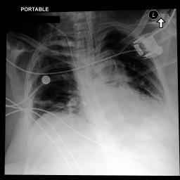

# Case 7 — Multimodal inpatient mortality: recovery-trajectory captured by agent

**qid:** `medmod_in-hospital-mortality_test_32646816_0` · **task:** `medmod_in_hospital_mortality`
**gold:** `[{'name': 'no'}]`

- **ClinSeek final** ✅: `['no']` (tool calls = 40, messages = 67)
- **Reasoning final** ❌: `['yes']` (tool calls = 1, messages = 3)

## Tool-call distribution

**ClinSeek:**
```
  ehr.run_sql_query                        26
  ehr.get_column_names                     3
  ehr.think                                3
  ehr.get_candidates_by_keyword            2
  ehr.load_ehr                             1
  image.chest_xray_classifier              1
  image.chest_xray_report_generator        1
  ehr.get_table_names                      1
  ehr.get_records_by_time                  1
  ehr.finish                               1
```

**Reasoning pipeline:**
```
  ehr.finish                               1
```

## Why the paradigms diverge

- Gold is 'no' despite ICU admission. Reasoning-mode mis-reads recent ICU data as ominous and predicts 'yes'.
- ClinSeek (Opus) pulls the later-timestamp events that reveal stabilization and confirms 'no'.
- Other calls loaded EHR, explored table schemas, identified lab item IDs, checked CXR images, looked for diagnoses/cancer history, and investigated data type issues with stay_id field.

## Vital ClinSeek tool calls (the calls that determined the agent's answer)

### 1. Call #14: `ehr.run_sql_query` — Vital signs: HR 107, BP 145/78, SpO2 92, RR 19 - stable hemodynamics without shock

**Why this call determined the answer:** Confirmed hemodynamic stability suggesting patient not actively dying

_Tool call:_ `ehr.run_sql_query({"subject_id": "14371035", "sql_query": "SELECT label, value, valuenum, charttime FROM events WHERE stay_id = '32646816.0' AND abbreviation IN ('hr', 'nbps', 'nbpd', 'nbpm', 'rr', 'spo2') AND charttime <= '2170-03-21 03:53:14' ORDER BY charttime DESC LIMIT 40"})`

_Tool result:_
```
                                label value valuenum           charttime
 non invasive blood pressure systolic   145      145 2170-03-21 03:03:00
non invasive blood pressure diastolic    78       78 2170-03-21 03:03:00
     non invasive blood pressure mean    96       96 2170-03-21 03:03:00
                           heart rate   107      107 2170-03-21 03:00:00
                     respiratory rate    19       19 2170-03-21 03:00:00
          o2 saturation pulseoxymetry    92       92 2170-03-21 03:00:00
 non invasive blood pressure systolic   130      130 2170-03-21 02:01:00
non invasive blood pressure diastolic    96       96 2170-03-21 02:01:00
     non invasive blood pressure mean   104      104 2170-03-21 02:01:00
                           heart rate   101      101 2170-03-21 02:00:00
                     respiratory rate    15       15 2170-03-21 02:00:00
          o2 saturation pulseoxymetry    93       93 2170-03-21 02:00:00
 non invasive blood pressure systolic   144      144 2170-03-21 01:01:00
non invasive blood pressure diastolic    73       73 2170-03-21 01:01:00
     non invasive blood pressure mean    90       90 2170-03-21 01:01:00
                           heart rate   101      101 2170-03-21 01:00:00
                     respiratory rate    16       16 2170-03-21 01:00:00
          o2 saturation pulseoxymetry    93       93 2170-03-21 01:00:00
 non invasive
…[truncated 1592 chars]
```

### 2. Call #23: `ehr.run_sql_query` — RASS 0 (Alert and calm) at 2170-03-21, GCS 15 (Spontaneous/Oriented/Obeys Commands)

**Why this call determined the answer:** Showed neurological improvement - patient alert and oriented, not deteriorating

_Tool call:_ `ehr.run_sql_query({"subject_id": "14371035", "sql_query": "SELECT DISTINCT label, value, charttime FROM events WHERE stay_id = '32646816.0' AND abbreviation IN ('richmond-ras scale', 'gcs - eye opening', 'gcs - verbal response', 'gcs - motor response') AND charttime <= '2170-03-21 03:53:14' ORDER BY charttime DESC LIMIT 20"})`

_Tool result:_
```
             label                                                                                       value           charttime
richmond-ras scale                                                                           0  Alert and calm 2170-03-21 00:00:00
richmond-ras scale                                                                           0  Alert and calm 2170-03-20 20:00:00
richmond-ras scale                  -2 Light sedation, briefly awakens to voice (eye opening/contact) < 10 sec 2170-03-20 08:00:00
richmond-ras scale                                          -1 Awakens to voice (eye opening/contact) > 10 sec 2170-03-20 04:00:00
richmond-ras scale                                          -1 Awakens to voice (eye opening/contact) > 10 sec 2170-03-20 00:00:00
richmond-ras scale                  -2 Light sedation, briefly awakens to voice (eye opening/contact) < 10 sec 2170-03-19 20:00:00
richmond-ras scale                                          -1 Awakens to voice (eye opening/contact) > 10 sec 2170-03-19 16:00:00
richmond-ras scale                               -3 Moderate sedation, movement or eye opening; No eye contact 2170-03-19 12:00:00
richmond-ras scale -4 Deep sedation, no response to voice, but movement or eye opening to physical stimulation 2170-03-19 11:30:00
richmond-ras scale                                                                        
…[truncated 40 chars]
```

### 3. Call #24: `ehr.run_sql_query` — GCS improving: from ETT/To Pain on 3/19-20 to Spontaneous/Oriented/Obeys on 3/20-21

**Why this call determined the answer:** Demonstrated clear trajectory of neurological recovery over 2 days

_Tool call:_ `ehr.run_sql_query({"subject_id": "14371035", "sql_query": "SELECT DISTINCT label, value, charttime FROM events WHERE stay_id = '32646816.0' AND label LIKE '%gcs%' AND charttime <= '2170-03-21 03:53:14' ORDER BY charttime DESC LIMIT 20"})`

_Tool result:_
```
                label           value           charttime
    gcs - eye opening   Spontaneously 2170-03-21 00:00:00
gcs - verbal response        Oriented 2170-03-21 00:00:00
 gcs - motor response  Obeys Commands 2170-03-21 00:00:00
    gcs - eye opening   Spontaneously 2170-03-20 20:00:00
gcs - verbal response        Oriented 2170-03-20 20:00:00
 gcs - motor response  Obeys Commands 2170-03-20 20:00:00
    gcs - eye opening   Spontaneously 2170-03-20 16:00:00
gcs - verbal response        Confused 2170-03-20 16:00:00
 gcs - motor response  Obeys Commands 2170-03-20 16:00:00
    gcs - eye opening   Spontaneously 2170-03-20 12:00:00
gcs - verbal response        Confused 2170-03-20 12:00:00
 gcs - motor response  Obeys Commands 2170-03-20 12:00:00
    gcs - eye opening       To Speech 2170-03-20 08:00:00
gcs - verbal response No Response-ETT 2170-03-20 08:00:00
 gcs - motor response  Obeys Commands 2170-03-20 08:00:00
    gcs - eye opening       To Speech 2170-03-20 04:00:00
gcs - verbal response No Response-ETT 2170-03-20 04:00:00
 gcs - motor response  Obeys Commands 2170-03-20 04:00:00
    gcs - eye opening         To Pain 2170-03-20 00:00:00
gcs - verbal response No Response-ETT 2170-03-20 00:00:00
```

### 4. Call #27: `ehr.run_sql_query` — O2 delivery changed from endotracheal tube to face tent/aerosol by 3/20 12:00

**Why this call determined the answer:** Confirmed successful extubation - respiratory improvement trajectory

_Tool call:_ `ehr.run_sql_query({"subject_id": "14371035", "sql_query": "SELECT DISTINCT label, value, charttime FROM events WHERE stay_id = '32646816.0' AND (label LIKE '%o2 delivery%' OR label LIKE '%ventilat%') AND charttime >= '2170-03-20 10:00:00' AND charttime <= '2170-03-21 03:53:14' ORDER BY charttime DESC LIMIT 20"})`

_Tool result:_
```
                label             value           charttime
o2 delivery device(s)               NaN 2170-03-21 00:00:00
o2 delivery device(s)               NaN 2170-03-20 20:00:00
o2 delivery device(s)               NaN 2170-03-20 16:00:00
o2 delivery device(s)      Aerosol-cool 2170-03-20 12:00:00
o2 delivery device(s)         Face tent 2170-03-20 12:00:00
      ventilator type          Hamilton 2170-03-20 11:00:00
o2 delivery device(s) Endotracheal tube 2170-03-20 11:00:00
```

### 5. Call #34: `ehr.run_sql_query` — Temperature 98.4F, afebrile despite leukocytosis

**Why this call determined the answer:** Showed no fever, reducing concern about active uncontrolled sepsis

_Tool call:_ `ehr.run_sql_query({"subject_id": "14371035", "sql_query": "SELECT DISTINCT label, value, charttime FROM events WHERE hadm_id = '25142109.0' AND label LIKE '%temperature%' AND charttime <= '2170-03-21 03:53:14' ORDER BY charttime DESC LIMIT 10"})`

_Tool result:_
```
                 label    value           charttime
temperature fahrenheit     98.4 2170-03-21 00:00:00
      temperature site     Oral 2170-03-21 00:00:00
temperature fahrenheit     98.2 2170-03-20 20:00:00
      temperature site     Oral 2170-03-20 20:00:00
      skin temperature     Warm 2170-03-20 20:00:00
temperature fahrenheit     98.2 2170-03-20 16:00:00
      temperature site Axillary 2170-03-20 16:00:00
      skin temperature     Warm 2170-03-20 16:00:00
temperature fahrenheit       98 2170-03-20 12:00:00
      temperature site Axillary 2170-03-20 12:00:00
```

### 6. Call #25: `ehr.run_sql_query` — No vasopressors (norepinephrine, vasopressin, etc.) found

**Why this call determined the answer:** Confirmed no hemodynamic support needed - not in septic shock

_Tool call:_ `ehr.run_sql_query({"subject_id": "14371035", "sql_query": "SELECT label, value, charttime FROM events WHERE stay_id = '32646816.0' AND label LIKE '%vasopressin%' OR label LIKE '%norepinephrine%' OR label LIKE '%dopamine%' OR label LIKE '%epinephrine%' OR label LIKE '%phenylephrine%' AND charttime <= '2170-03-21 03:53:14' ORDER BY charttime DESC LIMIT 20"})`

_Tool result:_
```
Query executed successfully but returned no results.
```

## ClinSeek final `ehr.think` synthesis (tail)
```
y ventilated, extubated around 2170-03-20 ~11-12:00
4. Now on face tent/aerosol-cool (extubated)
5. Sinus tachycardia (HR 100-116), now HR ~100-107
6. BP stable (130-155/73-96)
7. SpO2 92-93% (borderline) 
8. WBC 31.7 - very elevated leukocytosis
9. Hemoglobin 8.2, Hematocrit 25.9 - anemia
10. Bicarbonate 16 - metabolic acidosis
11. Chloride 114 - hyperchloremia
12. Calcium 7.8 - hypocalcemia
13. Glucose 198 - hyperglycemia
14. LDH 333 - elevated
15. Creatinine 0.8 - normal
16. GCS improving: was confused/impaired, now oriented (15) at midnight
17. RASS: -4 on Day 1 (deep sedation, was intubated), now 0 (alert and calm)
18. CAM-ICU was positive (delirium) on Day 1
19. Diminished lower lobe lung sounds bilaterally, rhonchi noted
20. Thick yellow sputum (infection)
21. Restraints for treatment interference and confusion
22. Temperature normal (98.2-98.4°F)

CXR findings:
- ETT in place (at time of CXR on 03/20 ~04:00 AM)
- Right IJ central line
- Mild cardiomegaly
- Left retrocardiac opacity (atelectasis/consolidation)
- Classifier: high prob for atelectasis, effusion, mass, lung opacity, consolidation

Positive factors (against death):
- Successfully extubated
- GCS improving to 15
- RASS improving to 0
- Normal temperature
- Normal creatinine
- BP stable without vasopressors
- No vasopressor requirement
- SBT successfully completed

Negative factors (for death):
- WBC 31.7 (very high)
- Metabolic acidosis (bicarb 16)
- Persistent tachycardia
- Severe anemia
- SpO2 borderline at 92-93%
- Multiple ICU admissions (chronic disease)
- Possible underlying malignancy

The patient appears to be improving - extubated, alert, following commands, no vasopressors. Despite the concerning labs (high WBC, anemia, acidosis), the clinical trajectory is one of improvement. The high WBC could be stress/infection-related and the anemia may be chronic. She was extubated and successfully completed SBT, which is a positive sign.

However, the 4th ICU admission in 5 years for a patient with likely underlying cancer and complex urologic issues, combined with the very high WBC, metabolic acidosis, and borderline oxygenation raises concerns. But the overall clinical trajectory with extubation and improving neurological status suggests she is unlikely to die during this specific ICU stay.

I'll say no - the patient's clinical trajectory suggests improvement rather than impending death.
```

## Linked chest-X-ray image(s) (what the model saw)



## Why reasoning mode got it wrong

**Reasoning-mode prediction:** `yes`

**Failure type:** `missing_evidence_in_prompt`

**Where it went wrong:** The reasoning model saw alarming labs (WBC 31.7, metabolic acidosis, anemia) and multiple ICU admissions but lacked the clinical trajectory data showing extubation, improving GCS, stable vitals, no vasopressors - all indicating recovery rather than decline.

**Missed evidence:** GCS improvement to 15, RASS 0, successful extubation to face tent, no vasopressors, stable vital signs - all showing recovery trajectory absent from curated prompt

**Pull quote from the reasoning reply:**

> This patient has multiple recurre... WBC 31.7 (markedly elevated - severe leukocytosis)... 100% neutrophils with no lymphocytes/monocytes (left shift, concerning for severe infection/sepsis)

## Full reasoning-mode output
```
Looking at the available data:

**Patient History:**
- 54-year-old white female with multiple ICU admissions (4 total, current being the 4th)
- Previous ICU stays in 2165, 2167, 2169, and now 2170 - suggesting chronic, recurrent critical illness
- Extensive CXR history (50 studies) indicating prolonged/repeated hospitalizations

**Current ICU Stay (admitted 2170-03-19):**
- Only ~2 days into this ICU stay at cutoff
- Labs show concerning findings:
  - WBC 31.7 (markedly elevated - severe leukocytosis)
  - 100% neutrophils with no lymphocytes/monocytes (left shift, concerning for severe infection/sepsis)
  - Hemoglobin 8.2 (anemia)
  - HCO3 16 with anion gap 16 (metabolic acidosis with elevated anion gap)
  - LDH 333 (elevated, tissue damage)
  - Glucose 198 (stress hyperglycemia)
  - Fibrinogen 631 (markedly elevated - acute phase reactant)
  - Calcium 7.8 (low)

**Chest X-ray (study 59744209):**
- Portable AP film showing what appears to be bilateral opacities, central lines/devices, and a port-a-cath visible. There appears to be bilateral infiltrates consistent with pneumonia or pulmonary edema.

**Assessment:**
This patient has multiple recurrent ICU admissions suggesting a chronic underlying condition (possibly malignancy given the port-a-cath). The current presentation shows severe sepsis/infection with marked leukocytosis, neutrophilia, metabolic acidosis, and bilateral pulmonary infiltrates. The combination of recurrent critical illness, severe infection markers, and metabolic derangements suggests a high mortality risk.

<answer>yes</answer>
```